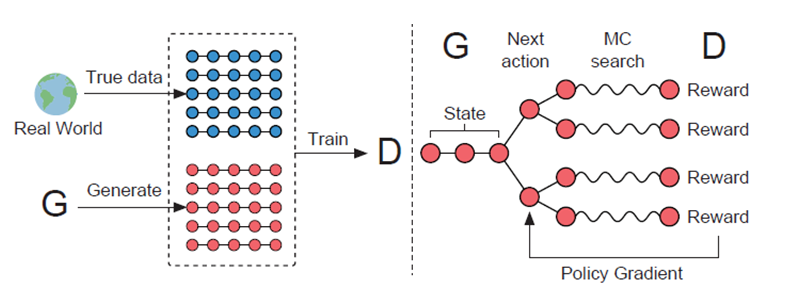
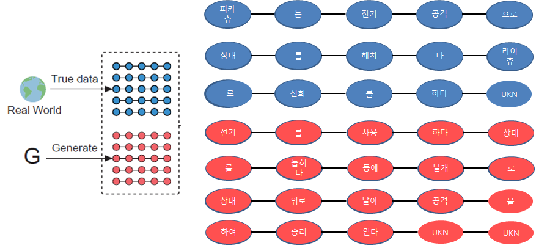
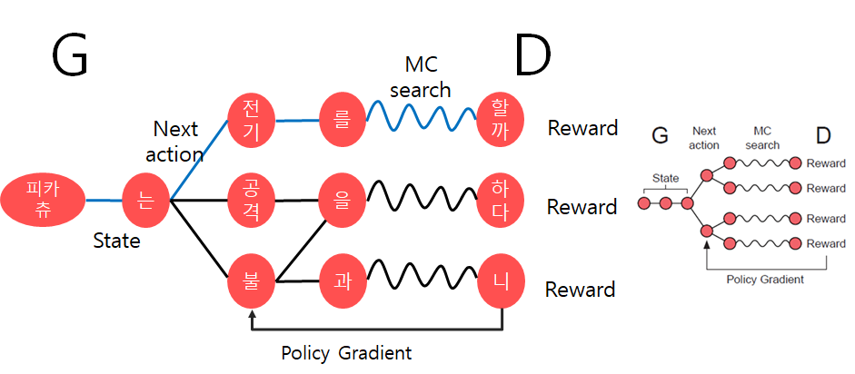
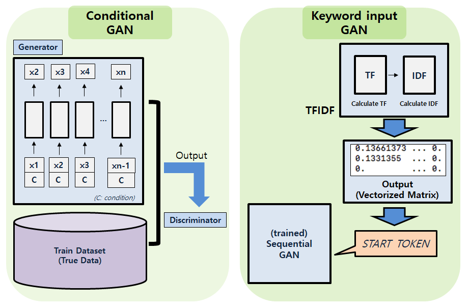

Character Story Generator with SeqGAN
=====================================
## Team Members
- [김경환(Kim Kyunghwan)](https://github.com/MrSyee)
- [김동환(Kim Donghwan)](https://github.com/hwan141592)
- [김효진(Kim Hyojin)](https://github.com/Hy000jin)
- [류원탁(Ryu Wontak)](https://github.com/rroundtable)
- [박준섭(Park junsep)](https://github.com/557mp)
- [이채원(Lee Chaewon)](https://github.com/chaewon-lee)
- [임희목(Yim Heemok)](https://github.com/heemokyim)

## 목표
- 만화나 게임 캐릭터의 배경스토리를 학습하여 **새로운 배경 스토리를 만드는 AI**를 개발한다.
- 본 프로젝트에서는 **포켓몬스터 이야기**를 데이러로 딥러닝에 학습하여 새로운 캐릭터 이야기를 생성한다.
- 포켓몬스터 속성을 추가로 이용하여 **속성에 맞는 구체적인 이야기**를 생성한다.

## 설명
- 캐릭터는 배경스토리를 통해 상품성이 올라간다. 하지만 새로운 이야기를 창작하는 것은 쉽지 않은 일이다.
- 본 프로젝트는 이러한 새로운 캐릭터 창작 활동에 도움을 줄 수 있도록 영감과 소재(문장 형태)를 제공하는 것을 목표로 한다.
- 시퀀스를 생성해내는 SeqGAN은 LSTM을 이용한 `Generator`와 문장을 구분하는 CNN으로 구성된 `Discriminator`의 경쟁을 통해 학습한다.
- SeqGAN은 일반적인 GAN과 다르게 강화학습에서 사용하는 `Policy Gradient` 방법으로 학습한다.
- SeqGAN에 포켓몬스터 이야기를 학습시켜 새로운 포켓몬스터 이야기를 생성한다.
- 다양한 속성에 맞는 이야기를 만들기 위하여 `Conditional GAN` 방법과 `TF-IDF를 적용한 키워드` 방법을 제안한다.

## 진행과정
1. web crawler
    - 포켓몬스터 나무위키의 데이터 중 포켓몬스터 이름, 속성, 이야기를 수집하였다.
2. word embedding
    - 수집한 한글 데이터를 Word2Vec을 통해 벡터화하였다.
3. SeqGAN
    - 시퀀스 데이터를 생성해내는 SeqGAN 구조의 신경망에 데이터를 학습시켰다.
4. Conditional SeqGAN
    - 속설별 이야기 생성을 위하여 SeqGAN에 Conditional GAN 구조를 활용하였다.
5. TF-IDF
    - 전체 데이터에서 속성별 키워드를 추출하여 SeqGAN의 스타팅 토큰으로 입력하여 속성별 이야기를 생성한다.
6. docs
    - 최종 발표자료 모음.

## Model Architecture
### SeqGAN  

### SeqGAN with condtion

## 결과

## Prerequisites
- python 3.6
- tensorflow 1.7.0
- bs4 0.0.1  
- gensim 3.5.0
- pandas 0.23.3
- konlpy 0.4.4
- scikit-learn 0.19.2
- nltk 3.3

## References
- [SeqGAN: Sequential Generative Adversarial Nets with Policy Gradient, IAAA, 2017](https://arxiv.org/abs/1609.05473)
- [SeqGAN (github)](https://github.com/LantaoYu/SeqGAN)
